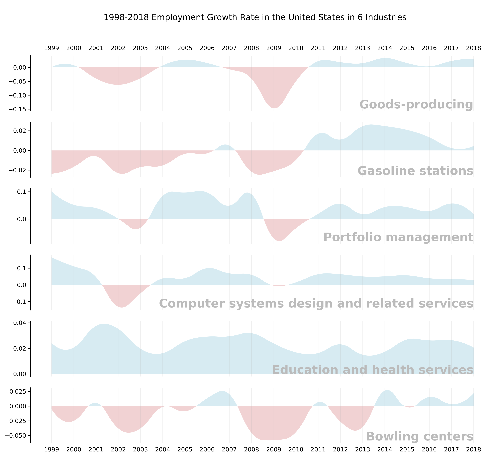

# Exploring the Employment-Related Dataset

## Overview

Checkout [ce_data_explore.ipynb](https://nbviewer.jupyter.org/github/wenoptics/ce-dataset-exploration-and-visualization/blob/7877720933ad65e3b38c122b7d960d501b1eca10/ce_data_explore.ipynb).

My objective of this visualization is to provide an intuitive perception of 
how the some aspects of employment (maybe more interested in Information Technology 
related fields) have been changing over time. The dataset that I will depend 
on will (primary) be National Employment, Hours, and Earnings (link to Kaggle) 
provided by Current Employment Statistics (CES).

For the purpose of the visualization, I would have to explore around the data, 
understand the dataset. This notebook exposes these steps...

Also checkout [oes_data.ipynb](./oes_data.ipynb), which focus on occupation data instead of 
industry data.

## Some Results:

### Employment Growth Rate in 6 Industries

A visualization of [_1998-2018 Employment Growth Rate in the United States in 6 Industries_ ](https://nbviewer.jupyter.org/github/wenoptics/ce-dataset-exploration-and-visualization/blob/7877720933ad65e3b38c122b7d960d501b1eca10/ce_data_explore.ipynb#6.4-Polish-the-Plots-(Completed-Section-for-Assignment-1))

> The 6 selected industries ( _i.e. 'Goods-producing',
 'Gasoline stations',
 'Portfolio management',
 'Computer systems design and related services',
 'Education and health services',
 'Bowling centers'_ ) 
 shows diversed pattern in employment growth rate over the years, where the X-axis are the year from 1999 to 2018 
 (1999 means the the period of 1998-1999), and the Y-axis are the growth rate to the previous year in percentage.
 The data is collected monthly, on non-supervisory employeers (production workers).
>  
> Worth mentioned that the year 2000 and the year 2008 cause signanificance negative employment rate on most industries, which, by I assumption, has great correlation to the 
[2000 Dot-com Bubble](https://en.wikipedia.org/wiki/Dot-com_bubble) 
and the [Financial crisis of 2007–2008](https://en.wikipedia.org/wiki/Financial_crisis_of_2007%E2%80%932008). 
During such periods, only the _Education and health services_ remain positive growth, and many other industries
in varies in different supersectors drops their employment.
> 
> And it can also be observed that the _Computer systems design and related services_ and 
_Education and health services_ has better resistance against the 2018 Financial crisis.
> 
> Dataset: 
> **National Employment, Hours, and Earnings** [(link to Kaggle)](https://www.kaggle.com/bls/employment#ce.series.csv) provided by _Current Employment Statistics (CES).

### Computer & Math related Occupation Income in the US

> **Comments:**
>
> This visualization takes data from OES 2018, showing a vivid result of how the occupation of Computer and Math related jobs are compensated across the U.S. The main figure (upper-left) shows the occupations of each individual 
U.S. counties. The upper-right figure shows the distribution of each income (median) ranges, in both logarithm (bar) and based-10 (line), which also served as a color legend. The lower left figure shows the counties ranking by wage data. And last but not the least the lower-right figure shows an enlarged map of the Pennsylvania counties data.
>
> **Improvement:**
> - Add stick for representing the data distributions of each ranked counties
